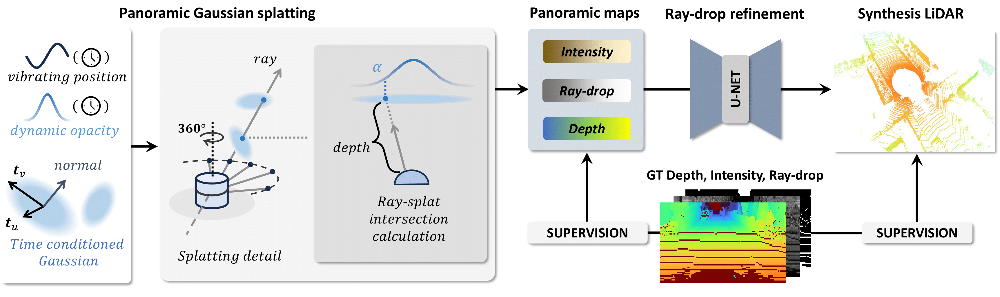

# GS-LiDAR: Generating Realistic LiDAR Point Clouds with Panoramic Gaussian Splatting

### [[Project]]() [[Paper]]() 

> [**GS-LiDAR: Generating Realistic LiDAR Point Clouds with Panoramic Gaussian Splatting**](),            
> Junzhe Jiang, Chun Gu, Yurui Chen, [Li Zhang](https://lzrobots.github.io)

**Official implementation of "GS-LiDAR: Generating Realistic LiDAR Point Clouds with Panoramic Gaussian Splatting".** 

## 🛠️ Pipeline

  

 

## 📜 BibTeX