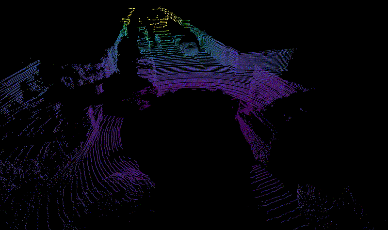
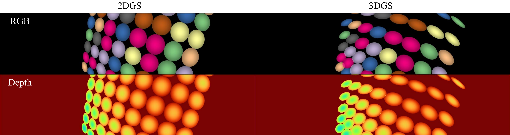

# GS-LiDAR: Generating Realistic LiDAR Point Clouds with Panoramic Gaussian Splatting

### [[Project]]() [[Paper]](https://arxiv.org/abs/2501.13971) 

> [**GS-LiDAR: Generating Realistic LiDAR Point Clouds with Panoramic Gaussian Splatting**](https://arxiv.org/abs/2501.13971),            
> [Junzhe Jiang](https://scholar.google.com/citations?user=gnDoDP4AAAAJ), [Chun Gu](https://sulvxiangxin.github.io/), [Yurui Chen](https://github.com/fumore), [Li Zhang](https://lzrobots.github.io)       
> **ICLR 2025**

**Official implementation of "GS-LiDAR: Generating Realistic LiDAR Point Clouds with Panoramic Gaussian Splatting".** 

## 🛠️ Pipeline
<div align="center">
  
</div><br/>

## Get started
### Environment
```
# Clone the repo.
git clone https://github.com/fudan-zvg/GS-LiDAR.git
cd GS-LiDAR

# Make a conda environment.
conda create --name gslidar python=3.9
conda activate gslidar

# Install PyTorch according to your CUDA version
# CUDA 11.7
pip install torch==2.0.1 torchvision==0.15.2 torchaudio==2.0.2

# Install requirements.
pip install -r requirements.txt

# Install simple-knn
git clone https://gitlab.inria.fr/bkerbl/simple-knn.git
pip install ./simple-knn

# compile packages in chamfer
cd chamfer/chamfer3D
python setup.py install
cd ../..
```

### 📁 Dataset
#### KITTI-360 dataset ([Download](https://www.cvlibs.net/datasets/kitti-360/download.php))
We use sequence00 (`2013_05_28_drive_0000_sync`) for experiments in our paper. Download KITTI-360 dataset (2D images are not needed) and put them into `data/kitti360`. The folder tree is as follows:
```bash
data
└── kitti360
    └── KITTI-360
        ├── calibration
        ├── data_3d_raw
        └── data_poses
```

Next, run KITTI-360 dataset preprocessing: (set `sequence_id`)  

```bash
python preprocess/kitti360_to_gs.py --seq {sequence_id}
```

After preprocessing, your folder structure should look like this:  

```bash
configs
├── base.yaml
├── kitti360_nvs_{sequence_id}.yaml
data
└── kitti360
    ├── KITTI-360
    │   ├── calibration
    │   ├── data_3d_raw
    │   └── data_poses
    └── {sequence_id}
        └── transforms_{sequence_id}_all.json
└── opv2v
```


### Training
```
# KITTI-360
# static
CUDA_VISIBLE_DEVICES=0 python train.py \
--config configs/kitti360_nvs_1908.yaml \
source_path=data/kitti360 \
model_path=eval_output/kitti360_reconstruction/1908

# dynamic
CUDA_VISIBLE_DEVICES=0 python train.py \
--config configs/kitti360_nvs_10750.yaml \
source_path=data/kitti360 \
model_path=eval_output/kitti360_reconstruction/10750
```

After training, evaluation results can be found in `{EXPERIMENT_DIR}/eval_output` directory.
The training logs will be saved in `log.txt`. If you need to display them in the terminal, please use the `--show_log` option.

### Evaluating
You can also use the following command to evaluate.
```
# KITTI-360
# static
CUDA_VISIBLE_DEVICES=0 python train.py \
--config configs/kitti360_nvs_1908.yaml \
source_path=data/kitti360 \
model_path=eval_output/kitti360_reconstruction/1908 \
--test_only

# dynamic
CUDA_VISIBLE_DEVICES=0 python train.py \
--config configs/kitti360_nvs_10750.yaml \
source_path=data/kitti360 \
model_path=eval_output/kitti360_reconstruction/10750 \
--test_only
```

You can visualize the lidar point cloud in 3d by using:
```
python scripts/visualize_lidar_in_video.py --seq {sequence_id}
```
The results will be saved in `eval_output/kitti360_reconstruction/{sequence_id}/eval/others` and will resemble the video shown below.



We also provide a Python script to help understand the implementation of **panorama Gaussian splatting** and the reason of choosing [2DGS](https://github.com/hbb1/2d-gaussian-splatting).
```
python scripts/compare_2dgs_3dgs.py
```
<div align="center">
  
</div><br/>

## 📜 BibTeX
``` bibtex
@inproceedings{jiang2025gslidar,
  title={GS-LiDAR: Generating Realistic LiDAR Point Clouds with Panoramic Gaussian Splatting},
  author={Jiang, Junzhe and Gu, Chun and Chen, Yurui and Zhang, Li},
  booktitle={International Conference on Learning Representations (ICLR)},
  year={2025}
}
```